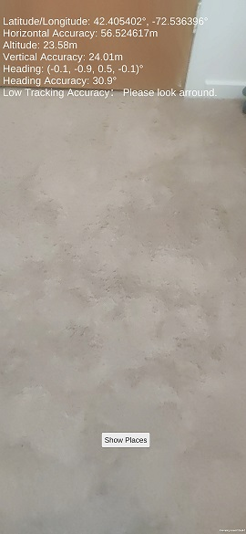

# Geospatial-URP

The project is currently set up to build an android apk

## SDK
This sample project is compatible with ARCore Extensions for AR Foundation v1.37.0.
https://github.com/google-ar/arcore-unity-extensions/releases/tag/v1.37.0

## Scenes

### Localization

The latitude, longitude, altitude, and azimuth of your smartphone and the accuracy of these are displayed on a screen.

### GetPlaces

Display list of restaurants nearby based on localization achieved.

## Required Setup
### Build Setting (in Unity)
[File]->[BuildSettings]
Select your development platform (Android/iOS) and click [Switch Platform].

## API Key
[Edit]->[ProjectSettings]->[XR Plug-in Management]->[ARCore Extensions]
Enter an API key created on Google Cloud Platform.

See [Set up a Google Cloud Project] of the official website for how to create an API Key.
https://developers.google.com/ar/develop/c/geospatial/developer-guide

## Run Pre-build APK
Download the APK generated (from the folder in the report) and install it on an android device and open the app.
Point at any location and click on the button 'Show places' at the bottom of the screen. This will pop up a panel with the list of places.

