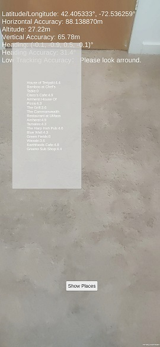

# Geospatial-URP

The project is currently set up to build an android apk

## SDK
This sample project is compatible with ARCore Extensions for AR Foundation v1.37.0.
https://github.com/google-ar/arcore-unity-extensions/releases/tag/v1.37.0

## Scenes

### 0-TrackingStateMonitoring

The latitude, longitude, altitude, and azimuth of your smartphone and the accuracy of these are displayed on a screen.

